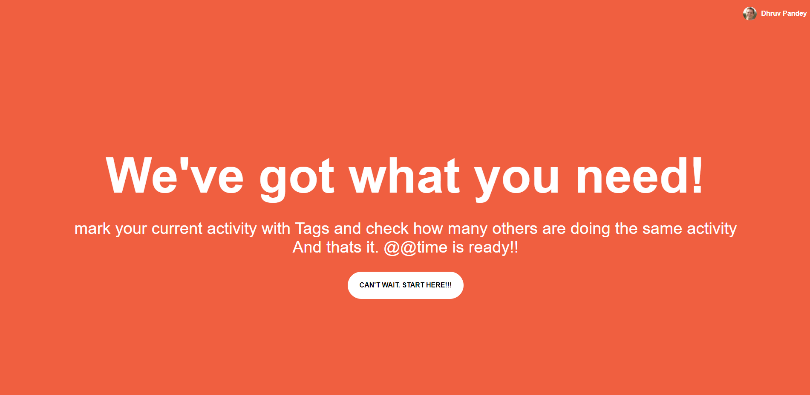
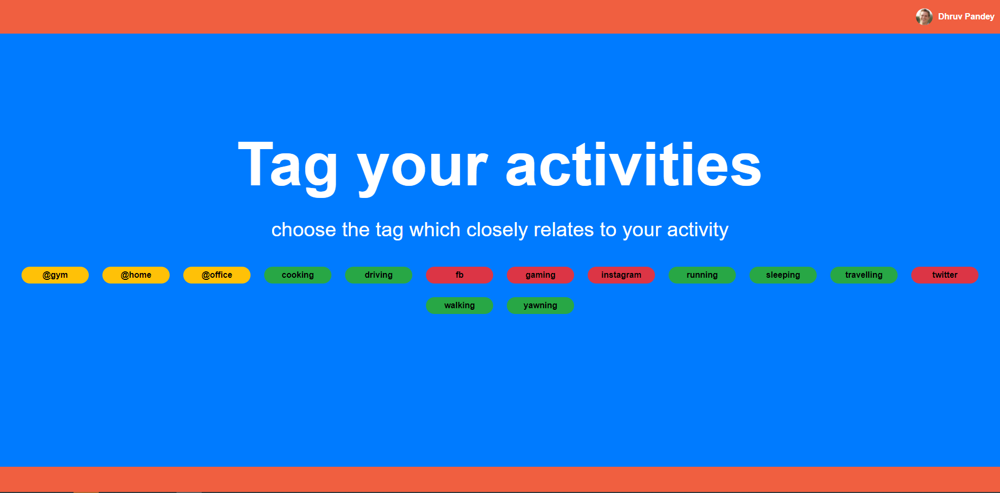
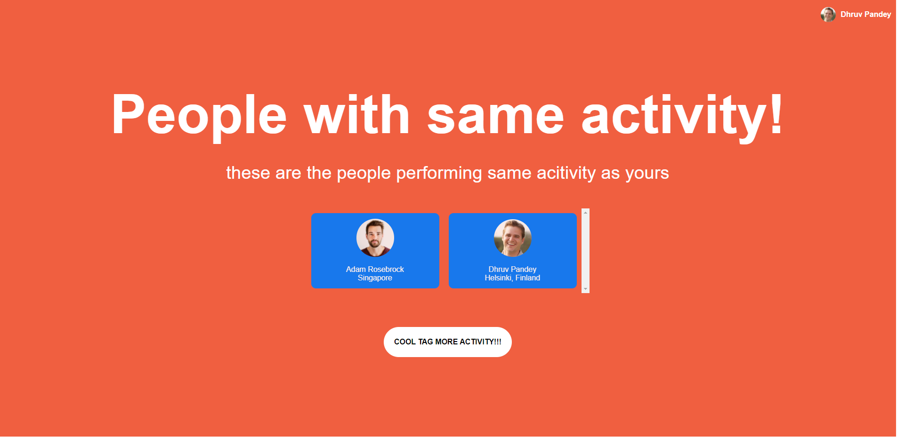

<h2>Idea</h2>
On a Wednesday night traveling by cab, I felt how many people would be doing the same activity as me at the same time. That's when I started implementing @@time(at a time). 

@@time is a simple application that lets users mark their current activity and then check the list of
other users doing the same activity at that time around the world.

> This a legacy app and not mantained or upgraded anymore.
> Check the latest React+TypeScript version <a target="_blank" href="https://github.com/pdhruv93/atatime-web-react">here</a>
> Check the react-native version <a target="_blank" href="https://github.com/pdhruv93/atatime-react-native-final">here</a>

<h2>Intro Screen</h2>

<h2>Activity List from Firebase</h2>

<h2>Other people doing the same activity</h2>

<h2>Mobile compatible</h2>

